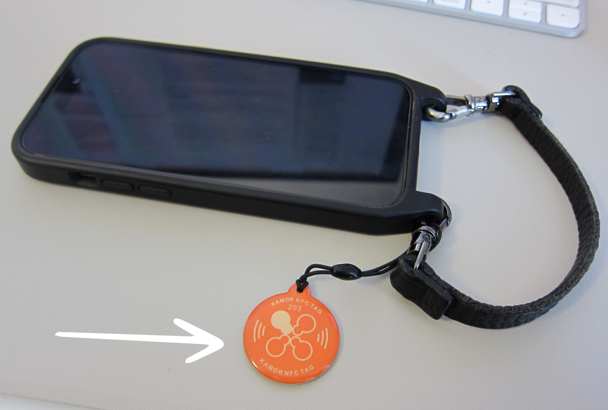

As someone who recently started attending more local networking events, I faced the classic problem of not having my info readily available when someone asked for it. Business cards are old school, now everyone uses LinkedIn which I didn't even have installed on my phone. While fumbling to find and scan QR codes and disrupting the conversations, it sparked the idea to make it more seamless by using NFC tags. I knew we had a bunch of readily available in our home which has quite the reputation to be a gadget household. 

>[!info]
>If you're not familiar with NFC (Near-Field Communication) tags, they're those handy little chips that allow devices to communicate when they're (really) close to each other. This is what powers contactless payments or quick file transfers between phones. 

# The Plan
I wanted to configure an NFC tag so it has my LinkedIn information and so that I just have to hold it to another person's phone to give them my info. And it was quite simple to make that happen.

1. Download an NFC Writing App: There are several apps available for both iOS and Android that can write information to NFC tags. On iOS, I used [Simply NFC](https://apps.apple.com/us/app/simply-nfc-tag-writer-reader/id1262550712).
2. Add your LinkedIn URL to the writing records: In the Write tab, click "Add Record" > "Add URL Record" and put your URL.
3. Write it to the tag: Click "Write URL" and hold the NFC tag against your phone.
4. Done!

 And just like that, your NFC tag is now ready to share your LinkedIn profile. Simply hold it against someone's phone, and a notification will prompt them to open their browser and access your LinkedIn Profile. It worked for about 90% of the people I tried this with, because of course it requires a modern smartphone and for default settings. 
# Right Content for the Right Context
While I use this exclusively in the professional context and using my LinkedIn profile, I learned about another handy application from Marco, another attendant at the AI tinkerer meetup. He shared a clever trick to draft a WhatsApp message to yourself on the scanning person's phone!
## Creating a Custom WhatsApp link
It's quite simple as well. Instead of using your LinkedIn URL, you create a personalized WhatsApp link.

1. Start with the base URL: `https://wa.me/`
2. Add your phone number including the country code, without spaces or special characters. `https://wa.me/+41761234567`
4. Add `"?text="` to your URL to indicate that you're going to add a pre-filled message. `https://wa.me/+41761234567?text=`
5. Compose your message that you'd want the person to have prefilled in their WhatsApp message to you, e.g., "Hi Sarah from DREI Solutions. We just met today. This is \< add your name here\>"
6. Make sure your message is in the right format by putting your text into an URL encoder, like https://www.urlencoder.org/ which results in something like: `Hi%20Sarah%20from%20DREI%20Solutions.%20We%20just%20met%20today.%20This%20is%20-%20add%20your%20name%20here`
7. Now put it all together for the final URL: `https://wa.me/+41761234567?text=Hi%20Sarah%20from%20DREI%20Solutions.%20We%20just%20met%20today.%20This%20is%20-%20add%20your%20name%20here` To test this, just put it in your browser.
8. Write this URL to your NFC tag.
9. Done!

When scanned, this will open WhatsApp (if installed) with a pre-filled message to your number, making it easy for your new contact to initiate a conversation.
# Magic?
This is neither rocket science nor an original idea, but the different reactions to seeing this in action were great. Everyone was super delighted by the smooth interaction, surprised that this small tag could instantly share my contact info. At an [AI Tinkerers](https://aitinkerers.org/p/welcome) event in Amsterdam, however, the tech-savvy attendees were more interested in the technical aspects, asking about the tag's data capacity or whether I wrote directly to the tag.
Either way and even if it was intended to be less disruptive to the conversation, it was always a great conversation starter and probably left a little memorable moment.

